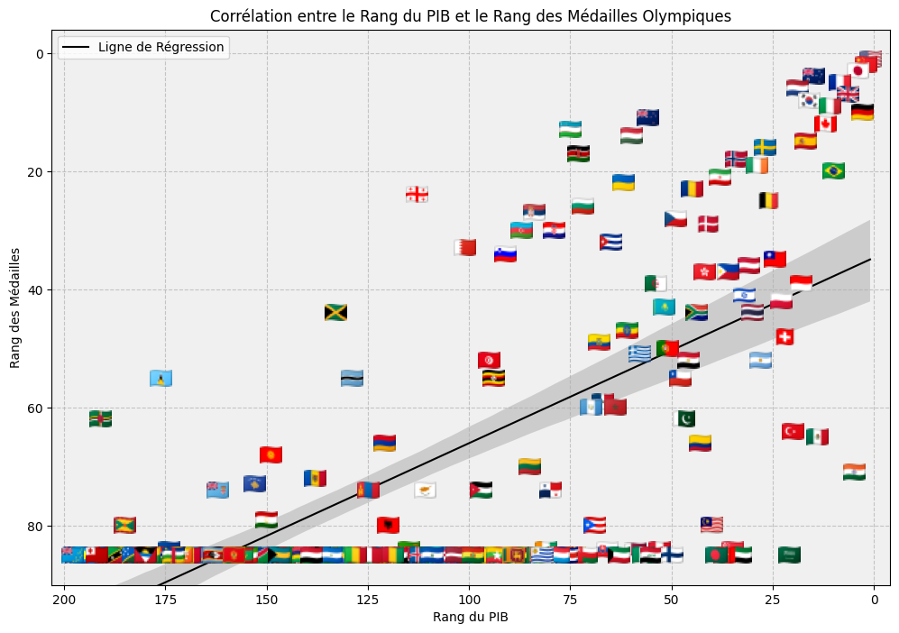

# 🥇 Analyse des Médailles des Jeux Olympiques

## 📝 Vue d'ensemble du projet

Ce projet vise à analyser la performance des pays aux Jeux Olympiques en fonction du PIB. 
Le projet explore la relation entre l'économie et le nombre de médailles remportées par chaque pays, et propose une visualisation pertinente pour illustrer cette corrélation.

## 📊 Fonctionnalités principales

- **Analyse des données** : Exploration des données des médailles des JO de 2024 par pays, avec intégration des données économiques.
- **Visualisation avancée** : Génération d'un graphique de corrélation.
- **Comparaison de ratios** : Comparaison du ratio médailles/PIB pour évaluer l'efficacité sportive relative des pays.

## 🚀 Pour commencer

### Prérequis

Pour exécuter ce projet, vous aurez besoin de :

- Python 3.x
- Les bibliothèques Python suivantes :
  - `pandas`
  - `matplotlib`
  - `seaborn`
  - `numpy`
  - `geopandas`
  - `requests`
  - `beautifulsoup4`

### Installation

1. Clonez ce dépôt sur votre machine locale :
   ```bash
   git clone https://github.com/abdeldev504/M-dailles-JO---Analyse.git
2. Installez les dépendances requises :
   ```bash
   pip install pandas matplotlib seaborn numpy geopandas requests beautifulsoup4
3. Exécutez le script principal :
   ```bash
   python src/analyse_medailles_jo.py

## 🔍 Détails de l'analyse

Le projet se concentre sur :

Corrélation PIB/médailles : Analyse du lien entre le produit intérieur brut (PIB) d'un pays et le nombre de médailles remportées.
Visualisation avec drapeaux : Génération d'un graphique où chaque pays est représenté par son drapeau.

## 📈 Résultats clés



*Figure 1 : Corrélation PIB/médailles*


Les pays avec un PIB élevé tendent à remporter plus de médailles, bien que des exceptions notables existent.
Certains pays à faible population se distinguent par un ratio médailles/population exceptionnel, révélant une grande efficacité sportive.
Les visualisations permettent de repérer rapidement les surperformances et sous-performances relatives des pays.

## 🔗 Ressources

Données sur les médailles des JO : https://en.wikipedia.org/wiki/2024_Summer_Olympics_medal_table
Données du PIB par pays :  "https://en.wikipedia.org/wiki/List_of_countries_by_GDP_(nominal)"
